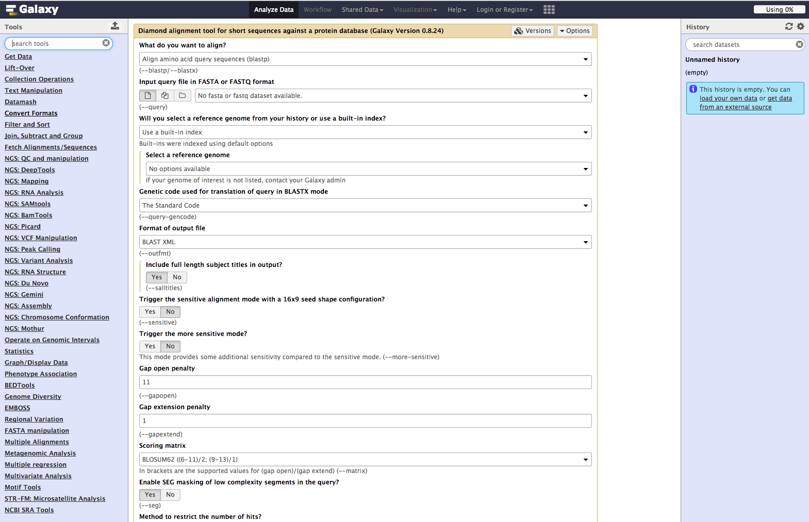

<!-- .slide: data-background="images/title.jpg" data-state="dim-background" -->
## Empowering usable, and comprehensive bioinformatics training

### Bérénice Batut

<small>She/her - [@bebatut](twitter.com/bebatut) - berenice.batut@gmail.com - [research.bebatut.fr](https://research.bebatut.fr)</small>

ISMB Education Cosi - July 2020

---
### Who am I?

- PhD in comparative genomics and artificial evolution, Lyon, France
- Post-doc in the Freiburg Galaxy Team, Freiburg, Germany
    - Biological data analysis & Tool development, mainly via Galaxy
    - Training
        - Co-leader of the [Galaxy Training Material](https://training.galaxyproject.org/)
        - Co-founder of the [Gallantries](https://galaxy-carpentries.github.io/gallantries/)
        - Co-founder and organizer of the [Open Life Science](https://openlifesci.org/)
        - Deputy training coordinator for [de.NBI](https://www.denbi.de/), [ELIXIR](https://elixir-europe.org/) Germany
        - [Carpentries](https://carpentries.org/) instructor
- Mother of a 5 month old baby (*still in parental leave*)

Note:
- Parental leave before COVID-19

---
<!-- .slide: data-background="images/student.jpg" data-state="dim-background" -->
## Sam's story

Note:
- Sam
- PhD student working on the impact of gut microbiota on brain cell aging
- Background in biology, physiology, but not in bioinformatics
- Need to do RNA-Seq analyses for their PhD
- Ask a bioinformatician to do the analyses
- but Sam's bioinformaticians are always busy and don't have time to explain the different steps
- But Sam would like also to be able to understand what is done and discuss with them the results
- Need to learn how to analyze their data
- But afraid it could be too complicated

----
### Galaxy: a great solution !

 <!-- .element width="60%" -->

- Web interface for numerous bioinformatics tools
- No need to learn about command lin

Note:
- Sam
- Heard about Galaxy from one of their colleague
- Think it could remove a 1st barrier
    - Web interface for numerous bioinformatics
    - Could use bioinformatics tools normally only accessible via command line without learning about command line
- Remaing barier: Need to learn how to analyze RNA-seq now using Galaxy

----
### Learning basics about Galaxy and RNA-Seq data 

 <!-- .element width="80%" -->

Galaxy Training Network (GTN) Material

<small>https://training.galaxyproject.org/</small>

Note:
- (before COVID) Found a training event teaching how
    - to use Galaxy
    - to analyze RNA-seq data
- Workshop using online ressources: Galaxy Training Material
- Hands-on tutorials
    - based on paper stories
    - reproduce step-by-step a analysis
    - idea: learning by doing

----
### Back to lab

 <!-- .element width="80%" -->

- 125+ platforms for using Galaxy
- UseGalaxy.*: 1000+ of documented and maintained tools, free registration, 250 GB per user & more on demand

<small>https://galaxyproject.org/use/</small>

Note:
- Use during the workshop
    - UseGalaxy.eu
    - European Galaxy instance
- Learn they could use it also once back to the lab
- Or one of the 125+ other platforms for using Galaxy
- To do their analyses
- Example: UseGalaxy.*
    - Thousands of documented and maintained tools
    - Free registration
    - 250 GB per user
        - 500 GB for ELIXIR members
        - More on demand

----
### Learning more through self-study

 <!-- .element width="70%" -->

- 16 topics - 160+ tutorials
- Learning metadata & Supporting material
- Automatic translation

<small>https://training.galaxyproject.org/</small>

Note:
- Sam
- Could learn more
- 16 topics - 160+ tutorials
- Learning metadata
    - Levels
    - Requirements and follow-up
    - Learning objectives
    - Timing
    - Tags
    - Authors
- Supporting material
    - Input data
    - Workflow
    - Support Galaxy servers with needed tools
- Automatic translation

----
### Getting help from the GTN Community

 <!-- .element width="60%" -->

- Public chat rooms for anyone with questions
- Directly accessible from tutorial pages

<small>https://gitter.im/Galaxy-Training-Network/</small>

Note:
- Sam
- Has questions about tutorials
- Open the chat directly in the tutorial page and ask their questions there
    - Get answers from the GTN community
    - Topic specific room, e.g. single-cell 

----
### Developping confidence to learn CLI

 <!-- .element width="65%" -->

R with RStudio inside Galaxy via interactive tools

<small>https://live.usegalaxy.eu/</small>

Note: 
- Sam
- Feel more confident about data analyses
- Want to learn more advanced, in particular for data visualization
- Heard can access RStudio directly inside Galaxy
    - via interactive tools
    - reachable at live.usegalaxy.eu
- Start by learning R basics
    - Resources adapted from The Carpentries by the Gallantries

----
### 

 <!-- .element width="90%" -->

- Curriculum combining Galaxy & R (here RNA-seq)
- Hybrid training for scalable training

<small>https://galaxy-carpentries.github.io/gallantries/</small>

Note:
- What is the Gallantries?
- When Galaxy meets Carpentries
- To develop and deliver open and scalable training in life sciences
- Development of RNA-seq curriculum
    - From sequences to visualization
    - Combination of Galaxy and R
- Development of new curriculums
- Infrastructure for scalable training: hybrid training
    - Remote instructors
    - Direct broadcast to several locations at the same time
    - Different sites with participants in a same room and local helpers to support them
    - Participants and helpers asking questions and giving feedback directly to instructors via collaborative document
- Used by several other teams like H3BIONET or Australia
- Has been adapted to COVID situation
- Sam participated to 1 event and get familiar with R

---
<!-- .slide: data-background="images/learner_to_teacher.jpg" data-state="dim-background" -->

## From learner to trainer

Note:
- Sam
- Practised a lot different data analyses and R on different data
- Got asked to help some colleagues
- Decided they could also learn in the same way
- But no workshop planned soon

----

### Being a node & helper for an hybrid training

 <!-- .element width="60%" -->

Note:
- Decided to be a node for an hydrid training of the Gallantries
- Occasion to help her colleagues
- See how it is to be an helper
- Occasion to learn how to teach
- Want to go further

----
### Following a training to become trainer

- [ELIXIR Train the Trainer program](https://elixir-europe.org/platforms/training/train-the-trainer)

    1. Principles of learning and how they apply to training
    2. Training techniques for enhancing learner engagement and participation
    3. Design of engaging sessions, materials and courses
    4. Assessment and feedback in training

- [The Carpentries Instructor Training course](https://carpentries.org/become-instructor/)

    1. Basics of educational psychology and instructional design
    2. How to apply both to teaching workshops for The Carpentries

Note:
- Sam
- Want to become a proper teacher
- Follow a Train the Trainer course
    - The Carpentries instructor
    - ELIXIR
- Learn principles of learning and teaching
- Feel ready to give training using Galaxy

----
### Giving Galaxy training

 <!-- .element width="80%" -->

<small>https://training.galaxyproject.org/</small>

Note:
- Sam
- Use tutorials from GTN
    - 16 scientific topics
    - 161 tutorials
- Tutorials
    - Ready to be used by instructors for workshop
    - Detailed step-by-step data analysis
        - Theoretical explanation of the analysis and the steps
            - sometimes in hidden box
        - Instruction to show directly in Galaxy how to run tools with parameters, and check the results
        - Assessments in form of Questions + answers to think about the analysis and their results and to interact with participants
        - Hints for some possible pitfalls
        - Data available 

----
### Giving Galaxy training
#### <!-- .element width="50%" -->

A community of public Galaxy servers which:
- support a wide number of tutorials
- have at least 250 GB public quota
- open/free registration

Note:
- Sam
- Think about which Galaxy server using
- usegalaxy.*, specially the US / EU / AUS
    - support GTN tutorials with tools needed
    - free registration with at least 250GB per users
        - good to start

----
### Giving Galaxy training
#### Shared data

 <!-- .element width="60%" -->

- All data for every GTN tutorials
- On all 3 official usegalaxy.* instances (US, EU, AU)
- Automatically updated every 2 weeks

Note:
- Sam
- All of the data, for every GTN tutorials, synced across all 3 official usegalaxy.* instances (US, EU, AU).
- This is automatically updated every 2 weeks
- Decide to use the european Galaxy server

----
### Giving Galaxy training
#### Training Infrastructure as a Service (TiaaS)

 <!-- .element width="70%" -->

- Private queue for training participants
- Anonymous, public overview of participants

<small>https://galaxyproject.eu/tiaas</small>

Note:
- Sam
- Do need to worry on the infrastructure
    - All of the tools and power of EU
        - No Galaxy Maintenance
        - No Galaxy Administration
- Read about the Training Infrastructure as a Service (TiaaS)
    - Even better
    - Free registration
    - Private queue for training participants
        - Jobs run faster
        - No waiting in the main queue
        - No delays in the training
    - Official Galaxy Training Materials are guaranteed to work and regularly tested
    - A dashboard to see how your students are progressing
        - Anonymous, public overview of training participants
        - useful with remote training

----
### Joining the Galaxy Training Network

 <!-- .element width="80%" -->

<small>https://galaxyproject.org/teach/</small>

Note:
- Sam
- Give several workshop
- Join the Galaxy Training Network

----
### Joining a large community of trainers

 <!-- .element width="80%" -->

A place to share resources, advice, and conversation: a website, a Slack workspace, and monthly community calls

<small>https://lifescitrainers.org/</small>

Note:
- Sam
- Invited to join a large community of trainers
- LifeSciTrainers
    - building a global community of practice
    - to improve life science by ensuring scientists and educators have the latest skills and knowledge they need to succeed
- Key activities of this group include
    - Advocating for trainers as vital members of the life science community.
    - Sharing knowledge and expertise related to professional development of trainers in the life sciences.
    - Developing and promoting standards (e.g. community consensus practices) for short-format training in life sciences.
- Slack with >300 members
- Monthly community call
- Website with resources and trainer registry and biographies

---
<!-- .slide: data-background="images/contributing.jpg" data-state="dim-background" -->

## To development of training material

Note:
- Sam
- Did and publish their analysis and create a Galaxy workflow
- Got request for training on this topic
- Need to develop their own Galaxy related material

----
### Developping training material for Galaxy

 <!-- .element width="60%" -->

- Tutorials written in Markdown and rendered with Jekyll
- Documentation in the form of tutorials

Note:
- Sam
- Follow tutorials for contributions
    - step-by-step
    - modification of existing tutorials to creating new tutorials or topics
- Tutorials
    - written in Markdown, to be as easy as possible
    - some formatting to create special boxes (hands-on, questions, etc)
    - Jekyll to render the tutorials and generate the website

----
### Developping training material for Galaxy

 <!-- .element width="70%" -->

Generation of the skeleton of a tutorial from a workflow in Galaxy with the Training Development Kit

<small>https://ptdk.herokuapp.com/</small>

Note:
- Sam
- Read and use the Training Development Kit
    - Webserver to create the skeleton of a tutorial
    - Takes a workflow on a Galaxy instance
    - Extract the different steps of the workflow and format them in a tutorial, including the parameters
    - Create an archive with the correct structure for the Galaxy Training materials
    - "Just" need to add the pedagogical aspects (explanations, questions, etc)

----
### Developing training material for Galaxy

 <!-- .element width="100%" -->

An open development process with support from the community

<small>https://github.com/galaxyproject/training-material/</small>

Note:
- Sam
- Get tutorial ready and want to submit it to the community
- Galaxy Training Material stored on GitHub
- Submit new tutorial to GitHub as a Pull Request
- Get reviews and also help from other contributors
    - A "senior" contributor gives comments and may also provide some sort of mentoring

----
### Joining the community of contributors

 <!-- .element width="70%" -->

<small>https://training.galaxyproject.org/hall-of-fame/</small>

Note:
- Sam
- Got tutorials added to the GT material
- Become part of a community of contributors
- Got listed in the Hall of Fame and their own page (tutorials, description, etc)

----
### Getting feedback on training material

 <!-- .element width="80%" -->

- Feedback form directly at bottom of tutorials
- Submission to GitHub issue

Note:
- Sam
- With tutorial online, can get feedback from people who take them
- Feedback form directly at bottom of tutorials
- Results collected in Google form and submitted to a GitHub issue to make them visible 

----
### Getting feedback on training material

 <!-- .element width="100%" -->

- More than 1,200 (mostly positve) feedback in less than 2 years
- Pro & con at tutorial level

Note:
- More than 1,200 (mostly positve) feedback collected in less than 2 years
- Details about what is working and what could be improved for each tutorial
- Feedback aggregated and reported to the community regularly

----
### Joining the community

 <!-- .element width="60%" -->

Online CoFests and community calls several times per year

Note:
- Sam
- Get involved in the community
- Participate to the online CoFests and community calls
- Want to be more involved
- Review content & Contributing

---
<!-- .slide: data-background="images/ols_story.jpg" data-state="dim-background" -->

## Starting and leading their own project

Note:
- Sam
- Feeling confident to start a new project
    - Add details about a project
- Start their own project as post-doc
- Heard about open science
- Want to become an Open Science practitioner

----
### Joining the Open Life Science program

 <!-- .element width="100%" -->

A 16-week long online mentorship and cohort-based training for Open Science ambassadors

<small>https://openlifesci.org/</small>

Note:
- Sam
- Heard about Open Life science
- Join with their project
- Participate in two types of calls
    - cohort group-training calls that introduce open science topics, with guest speakers and experts
    - one-on-one mentorship discussions with their mentors, about how these concepts are being applied to Sam project
- At the end of each calls, assignments are given to apply the open leadership skills to their project.

----
### Becoming an Open Science practitioner

 <!-- .element width="70%" -->

<small>[OLS image for BCC talk](https://docs.google.com/presentation/d/13oi1NjwnStAwC0PqIB22xwai_iUQRDQ94BIwR7b5yH4/present?token=AC4w5Vh5PZq0YVvpS5DjAlnjrFFQTYBYHg%3A1594229079112&includes_info_params=1&eisi=COGczo-WvuoCFW3E0gQdQDEANg#slide=id.g8ae0064c0e_0_122)</small>

Note:
- Gain open leadership skills
- Apply these skills hands-on to their project
- Builds confidence and allows them to embed open science in all aspects of their work, not just the original project idea they brought to OLS

----

 <!-- .element width="65%" -->

----
### Becoming mentor & expert

 <!-- .element width="70%" -->

<small>[OLS image for BCC talk](https://docs.google.com/presentation/d/13oi1NjwnStAwC0PqIB22xwai_iUQRDQ94BIwR7b5yH4/present?token=AC4w5Vh5PZq0YVvpS5DjAlnjrFFQTYBYHg%3A1594229079112&includes_info_params=1&eisi=COGczo-WvuoCFW3E0gQdQDEANg#slide=id.g8b9c80d844_0_14)</small>

Note:
- Sam is now an Open Science practitioner
- Understand the gaps others may in Open Science
- Can now join OLS as mentor to guide mentee with their project
- Become also expert to share their knowledge with all participants by giving talks during cohort calls and help other projects with some consulting
- Receive mentoring support and build meaningful connections

---
<!-- .slide: data-background="images/path.jpg" data-state="dim-background" -->
## Sam's story: Empowering learners!

<small>*Disclaimer: Story based them mostly on projects I know well as I am involved in. Many other paths are possible*</small>

- <!-- .element: class="footer" --> Photo by <a href="https://unsplash.com/@gcalebjones?utm_source=unsplash&amp;utm_medium=referral&amp;utm_content=creditCopyText">Caleb Jones</a> on <a href="https://unsplash.com/s/photos/path?utm_source=unsplash&amp;utm_medium=referral&amp;utm_content=creditCopyText">Unsplash</a>

Note:
- Summary schema of the path
- Fake but likely story
- Many possible paths
- Other possible path

---
<!-- .slide: data-background="images/empowering_bioinformatics_training.jpg" data-state="dim-background" -->

## How to empower usable, and comprehensive bioinformatics training?

Note:
What could make that feasible?
What do we need to build meaningful, powerful and empowering bioinformatics training
What could be powerful bioinformatic training
Empowering usable, and comprehensive bioinformatics training

----
<!-- .slide: data-background="images/short_format.jpg" data-state="dim-background" -->

## Prefer short-format

Ideal to acquire or reinforce skills

- <!-- .element: class="footer" --> Photo by <a href="https://unsplash.com/@tchompalov?utm_source=unsplash&amp;utm_medium=referral&amp;utm_content=creditCopyText">Vlad Tchompalov</a> on <a href="https://unsplash.com/s/photos/small?utm_source=unsplash&amp;utm_medium=referral&amp;utm_content=creditCopyText">Unsplash</a>

Note:
- Rapid evolution of new technologies and approaches
- Difficult for formal training to stay up-to-date
- MOOC have fallen short
    - suffer from low completion rates
    - vary widely in scope, rigor, and approach
    - persist even when content is in error or obsolete
    - present difficulties for learners when they wish to interact and ask questions, especially in large courses, or when offered asynchronously
    - do not serve diverse learners equally, continuing patterns of inequity
- Short-format training
    - provides point-of-need training where participants learn skills they can immediately bring into practice
    - is often lower in time commitment and costs, making it more accessible than alternatives such as sabbaticals, online learning, or additional degrees
    - is focused on either foundational skills or rapidly emerging techniques

----
## Make training material FAIR

 <!-- .element width="70%" -->

<small>[Garcia et al, Plos Comp Biol, 2020](https://journals.plos.org/ploscompbiol/article?id=10.1371/journal.pcbi.1007854) + Poster </small>

Note:
- 
Search for material
GTN
FAIR training
tess

Creating materials is a key task in the development of every training course. As trainers, we often turn to the internet for inspiration and/or to find existing training materials that can be adapted and reused. This search for materials can be a challenging and time consuming task. Within ELIXIR we saw an opportunity to improve this situation by translating the FAIR principles (that have been applied to data and software) into 10 simple rules to make training materials easier to find, access, reuse and cite.

These 10 simple steps are the beginning of a journey towards FAIRifying training materials and making them easier to find, share, reuse and cite. We hope that this inspires conversations and collaborations within global training communities that will lead to positive changes in the way we work and think about training. To learn more about the 10 steps you can read the paper in full in PLoS Computational Biology (https://doi.org/10.1371/journal.pcbi.1007854).

----
<!-- .slide: data-background="images/online.jpg" data-state="dim-background" -->

## Share all resources online

- <!-- .element: class="footer" --> Photo by <a href="https://unsplash.com/@phaelnogueira?utm_source=unsplash&amp;utm_medium=referral&amp;utm_content=creditCopyText">Raphael Nogueira</a> on <a href="https://unsplash.com/s/photos/online?utm_source=unsplash&amp;utm_medium=referral&amp;utm_content=creditCopyText">Unsplash</a>

Note:
- Give access to the resources
- More online
- Learn from the COVID situation to move to more online
- Hybrid training: Gallantries, H3bionet, Australia
- Some recommendations
- Full online program: OLS
- Some recommendations
- Galaxy paper for online
- Reaching learners everywhere: H3Bionet, OLS

----
<!-- .slide: data-background="images/reusable.jpg" data-state="dim-background" -->

## Provide infrastructure to make training (re)usable

- <!-- .element: class="footer" --> Photo by <a href="https://unsplash.com/@morningbrew?utm_source=unsplash&amp;utm_medium=referral&amp;utm_content=creditCopyText">Morning Brew</a> on <a href="https://unsplash.com/s/photos/reuse?utm_source=unsplash&amp;utm_medium=referral&amp;utm_content=creditCopyText">Unsplash</a>

Note:

- Learners
    - Online Material
    - Required tools reachable
- Instructors
    - Details how to use the material
    - Technical infrastructure

Instructor: 
Make required tools available
Annotation of material (levels, requirements, follow up, etc)  to build learning path
Provide infrastructure
TiaaS

----
<!-- .slide: data-background="images/empower.jpg" data-state="dim-background" -->

## Empower learners

- <!-- .element: class="footer" --> Photo by <a href="https://unsplash.com/@jibarofoto?utm_source=unsplash&amp;utm_medium=referral&amp;utm_content=creditCopyText">Luis Quintero</a> on <a href="https://unsplash.com/s/photos/fist?utm_source=unsplash&amp;utm_medium=referral&amp;utm_content=creditCopyText">Unsplash</a>

Note:
- Learning by doing
- Exercises: GTN, OLS, The Carpentries
- Give them the opportunity and tools to teach their colleagues
- Build Path from learners to instructors and developer of training content

----
<!-- .slide: data-background="images/interaction.jpg" data-state="dim-background" -->

## Provide a safe environment for interactions and support

- <!-- .element: class="footer" --> Photo by <a href="https://unsplash.com/@lunarts?utm_source=unsplash&amp;utm_medium=referral&amp;utm_content=creditCopyText">Volodymyr Hryshchenko</a> on <a href="https://unsplash.com/s/photos/communication?utm_source=unsplash&amp;utm_medium=referral&amp;utm_content=creditCopyText">Unsplash</a>

Note:
- In-person
- Hybrid training
- Chat
- Exchange environments: chat, slack

----
<!-- .slide: data-background="images/open.jpg" data-state="dim-background" -->

## Work open

- <!-- .element: class="footer" --> Photo by <a href="https://unsplash.com/@philberndt?utm_source=unsplash&amp;utm_medium=referral&amp;utm_content=creditCopyText">Philipp Berndt</a> on <a href="https://unsplash.com/s/photos/open?utm_source=unsplash&amp;utm_medium=referral&amp;utm_content=creditCopyText">Unsplash</a>

Note:
- Content
- Structure
- Communication
- Culture to work collaboratively, not to compete

----
<!-- .slide: data-background="images/feedback.jpg" data-state="dim-background" -->

## Collect feedback

- <!-- .element: class="footer" --> Photo by <a href="https://unsplash.com/@kellysikkema?utm_source=unsplash&amp;utm_medium=referral&amp;utm_content=creditCopyText">Kelly Sikkema</a> on <a href="https://unsplash.com/s/photos/opinion?utm_source=unsplash&amp;utm_medium=referral&amp;utm_content=creditCopyText">Unsplash</a>

Note:
- Feedback loop
- Collect feedback at different levels
- Apply them

----
<!-- .slide: data-background="images/instructor_training.jpg" data-state="dim-background" -->

## Train instructors

- <!-- .element: class="footer" --> Photo by <a href="https://unsplash.com/@bruno_nascimento?utm_source=unsplash&amp;utm_medium=referral&amp;utm_content=creditCopyText">Bruno Nascimento</a> on <a href="https://unsplash.com/s/photos/training?utm_source=unsplash&amp;utm_medium=referral&amp;utm_content=creditCopyText">Unsplash</a>

Note:
- The Carpentries

----
<!-- .slide: data-background="images/community.jpg" data-state="dim-background" -->

## Build a community around it

- <!-- .element: class="footer" --> Photo by <a href="https://unsplash.com/@perrygrone?utm_source=unsplash&amp;utm_medium=referral&amp;utm_content=creditCopyText">Perry Grone</a> on <a href="https://unsplash.com/?utm_source=unsplash&amp;utm_medium=referral&amp;utm_content=creditCopyText">Unsplash</a>

Note:
- Training sustainable if driven by a community: GTN, The Carpentries
    The Carpentries has reached more than 64,000 researchers through 2,562 workshops in 46 countries and assessment data suggests they are achieving sustainable impact. Their ability to accomplish this with an all-volunteer instructor core of more than 2,500 researchers also suggests both that SFT can be sustainable and can achieve global impact.
- Feeling supported: Life-Sci Trainers
Community of instructors to share the work, propagate, learn from each other (discussions, training philosophies)
- Transparent communication between us and with the community
----
<!-- .slide: data-background="images/mentoring.jpg" data-state="dim-background" -->

## Mentor everybody

- <!-- .element: class="footer" --> Photo by Bérénice Batut on Flickr

Note:
Mentoring
Contributors
New projects
Mentor new contributors

----
<!-- .slide: data-background="images/acknowledge.jpg" data-state="dim-background" -->
## Acknowledge the people

- <!-- .element: class="footer" --> Photo by <a href="https://unsplash.com/@timoun?utm_source=unsplash&amp;utm_medium=referral&amp;utm_content=creditCopyText">Tim Oun</a> on <a href="https://unsplash.com/s/photos/thank-you?utm_source=unsplash&amp;utm_medium=referral&amp;utm_content=creditCopyText">Unsplash</a>

----
<!-- .slide: data-background="images/kindness.jpg" data-state="dim-background" -->
## Be kind and supportive

- <!-- .element: class="footer" --> Photo by <a href="https://unsplash.com/@krewellah87?utm_source=unsplash&amp;utm_medium=referral&amp;utm_content=creditCopyText">Andrea Tummons</a> on <a href="https://unsplash.com/s/photos/kindness?utm_source=unsplash&amp;utm_medium=referral&amp;utm_content=creditCopyText">Unsplash</a>

Note:
- Trust and confidence towards each other
- Accountability, complementarity and gratitude
- Supportive network of friends and colleagues

---

 <!-- .element width="100%" -->

---
### Thank you!

 <!-- .element width="95%" -->

Note:
Acknowledgement
GTN
OLS

---
### Thank you!

 <!-- .element width="100%" -->

