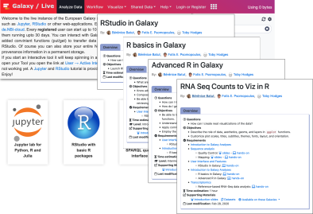
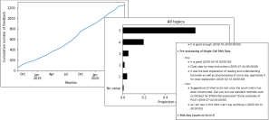
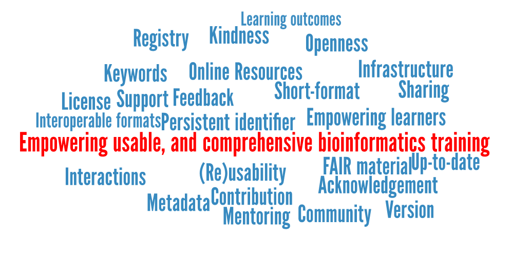

<!-- .slide: data-background="images/title.jpg" data-state="dim-background" -->
## Empowering usable, and comprehensive bioinformatics training

### Bérénice Batut

<small>[@bebatut](twitter.com/bebatut) - berenice.batut@gmail.com - [research.bebatut.fr](https://research.bebatut.fr)</small>

ISMB Education Cosi - July 2020

---
### Who am I?

Not sure to have such slide

---
<!-- .slide: data-background="images/student.jpg" data-state="dim-background" -->
## Sam's story

Note:
- Sam
- PhD student working on the impact of gut microbiota on brain cell aging
- Background in biology, physiology, no bioinformatics
- Need to do RNA-Seq analyses
- Could ask a bioinformatician to do the analyses
- but Sam's bioinformaticians are always busy and don't have time to explain the different steps
- Sam would like also to be able to understand what is done and discuss with them
- Need to learn how to analyze their data
- But afraid it could be too complicated

----
### Galaxy: a great solution !

 <!-- .element width="60%" -->

- Web interface for numerous bioinformatics tools
- No need to learn about command lin

Note:
- Heard about Galaxy from one of their colleague
    - Remove a 1st barrier: Found a comprehensive website with information. Found out that they can attend a workshop and learn from experts.
    - Remove 2nd barriere: no need to learn about command line
- Need to learn how to analyze RNA-seq now using Galaxy
- (before COVID) Found a training event teaching how
    - to use Galaxy
    - to analyze RNA-seq data

----
### Learning basics about Galaxy and RNA-Seq data 

 <!-- .element width="80%" -->

Galaxy Training Network (GTN) Material

<small>https://training.galaxyproject.org/</small>

Note:
- Workshop using online ressources: Galaxy Training Material
- Tutorials
    - based on paper stories
    - reproduce step-by-step a analysis
    - learning by doing
- UseGalaxy.eu

----
### Back to lab

 <!-- .element width="80%" -->

125+ platforms for using Galaxy

<small>https://galaxyproject.org/use/</small>

Note:
Could use the resources once back to lab
Online
Server accessible

----
### Learning more through self-study

 <!-- .element width="70%" -->

<small>https://training.galaxyproject.org/</small>

Note:
- 18 topics
- 140+ tutorials
- Learning metadata:
    - Levels
    - Requirements and follow-up
    - Learning objectives
    - Timing
    - Tags
    - Authors
- Supporting material
    - Input data
    - Workflow
- Automatic translation

----
### Developping confidence to learn CLI

 <!-- .element width="65%" -->

R with RStudio inside Galaxy via interactive tools + tutorials

<small>https://live.usegalaxy.eu/</small>

Note: 
- Feels more confident
- Want to learn more advanced
- Start by learning R
    - Can access RStudio directly inside Galaxy via interactive tools, reachable at live.usegalaxy.eu
    - Learn R basics using resources adapted from The Carpentries by the Gallantries

----
### 
#### To develop and deliver open and scalable training in life sciences

 <!-- .element width="100%" -->

<small>https://galaxy-carpentries.github.io/gallantries/</small>

Note:
- When Galaxy meets Carpentries to develop and deliver open and scalable training in life sciences

---
<!-- .slide: data-background="images/learner_to_teacher.jpg" data-state="dim-background" -->

## From learner to trainer

----

#### Being a node & local helper during an hybrid training

 <!-- .element width="60%" -->

Note:
- Back to Sam
- Got asked to help some colleagues
- Decided to organize a workshop
    - Node for an hydrid training: Gallantries
- Occasion to learn how to teach

----
#### Following a training to become trainer

- [ELIXIR Train the Trainer program](https://elixir-europe.org/platforms/training/train-the-trainer)

    1. Principles of learning and how they apply to training
    2. Training techniques for enhancing learner engagement and participation
    3. Design of engaging sessions, materials and courses
    4. Assessment and feedback in training

- [The Carpentries Instructor Training course](https://carpentries.org/become-instructor/)

    1. Basics of educational psychology and instructional design
    2. How to apply both to teaching workshops for The Carpentries

Note:
- Want to teach now
- Follow a Train the Trainer course
    - The Carpentries instructor
    - ELIXIR

----
### Infrastructure for Galaxy training
#### <!-- .element width="50%" -->

A community of public Galaxy servers which:
- support a wide number of tutorials
- have all required training data
- have at least 250 GB public quota
- open/free registration

Note:
- Sam

----
### Infrastructure for Galaxy training
#### Shared data

 <!-- .element width="60%" -->

- All data for every GTN tutorials
- On all 3 official usegalaxy.* instances (US, EU, AU)
- Automatically updated every 2 weeks

Note:
- Sam
- All of the data, for every GTN tutorial, is synced across all three official usegalaxy.* instances (US, EU, AU).
- This is automatically updated every 2 weeks

----
### Infrastructure for Galaxy training
#### Training Infrastructure as a Service (TiaaS)

 <!-- .element width="70%" -->

- Private queue for training participants
- Anonymous, public overview of participants

<small>https://galaxyproject.eu/tiaas</small>

Note:
- Sam do need to worry on the infrastructure
- TiaaS
    - Free service from UseGalaxy.eu for open Galaxy Trainings
    - All of the tools and power of EU
        - No Galaxy Maintenance
        - No Galaxy Administration
    - Private queue for your users
        - Jobs run faster, no waiting in the main queue. No delays in your training
    - Official Galaxy Training Materials are guaranteed to work and regularly tested
    - A dashboard to see how your students are progressing
        - Anonymous, public overview of students in your course
        - useful with COVID-19 and remote training to know what your students are doing

----
### Infrastructure for Galaxy training
#### GTN Community

 <!-- .element width="40%" -->

Public chat room for anyone with **training questions**, **looking for a trainer**, or just **needing help** with a tutorial

<small>https://gitter.im/Galaxy-Training-Network/Lobby</small>

Note:
- Sam

----
### Joining a large community of trainers

 <!-- .element width="80%" -->

A place to share resources, advice, and conversation via a website, a Slack workspace, and monthly community calls

<small>https://lifescitrainers.org/</small>

Note:
- Sam
- Vision: LifeSciTrainers improves life science by ensuring scientists and educators have the latest skills and knowledge they need to succeed. 
- Mission: LifeSciTrainers accomplishes its mission by building a global community of practice for life science trainers: anyone who delivers short-format training (workshops, boot camps, short-courses, etc.) – often on new and quickly evolving topics – in the life sciences. Community-of-practice involves establishing forums for these trainers to share their knowledge, resources, and expertise, develop and promote standards for training, open educational resources, and establish the role of trainer as a vital position within the life science community. 

    Key activities of this group include:

    - Advocating for trainers as vital members of the life science community.
    - Sharing knowledge and expertise related to professional development of trainers in the life sciences.
    - Developing and promoting standards (e.g. community consensus practices) for short-format training in life sciences.

- Why we exist  – What are the challenges and opportunities that lead to this community’s formation

    Challenges:

    - No matter how much the training behind a degree is updated and improved, the shelf-life of skills is getting shorter in a rapidly changing, more interdisciplinary world. As a result, many life scientists and life science educators find they lack access to the training and skills they need to deliver the best quality research and education. 
    - Short-format training has been used extensively in the life sciences. Evidence and collective experience show that short-format training has challenges in achieving sustained learning, and we have difficulty understanding the long-term impact of this form of training. Because topics evolve quickly, it is difficult for us to iterate our materials and direct their sustained improvement. 
    - We typically fail to create organizational structures (e.g. professional societies, journals) that could unite efforts, promote excellence amongst these trainers, or result in professional recognition and career paths. 

- Slack
- >300 members

---
<!-- .slide: data-background="images/contributing.jpg" data-state="dim-background" -->

## To development of training material

Note:
- Sam
- Did and publish their analysis and create a Galaxy workflow
- Got request for training on this topic
- Need to develop their own Galaxy related material

----
### Developping training material for Galaxy
#### Following the tutorials

 <!-- .element width="60%" -->

----
### Developping training material for Galaxy
#### Generating the skeleton of a tutorial from a workflow in Galaxy using the Training Development Kit

 <!-- .element width="70%" -->

<small>https://ptdk.herokuapp.com/</small>

Note:
- Use the Galaxy Training Development kit to create a new tutorial

----
### Developing training material for Galaxy
#### An open development process, with mentoring

 <!-- .element width="100%" -->

<small>https://github.com/galaxyproject/training-material/</small>

Note:
- Submit it to GitHub as a PR
- Got help and reviews...
- Mentoring to empower contributors

----
### Joining the community of contributors

 <!-- .element width="70%" -->

<small>https://training.galaxyproject.org/hall-of-fame/</small>

Note:
- Sam
- Become part of a community of contributors

----
### Joining the community
#### Online CoFest and community calls

 <!-- .element width="60%" -->

- Every 3 months
- One day of CoFest
- 2 community calls

Note:
- Sam

----
### Getting feedback on training material

 <!-- .element width="80%" -->

- Feedback form directly at bottom of tutorials
- Submission to GitHub issue

Note:
- Sam
- Online
- Got feedback

----
### Getting feedback on training material

 <!-- .element width="100%" -->

- More than 1,200 (mostly positve) feedback in less than 2 years
- Pro & con at tutorial level

Note:
- Sam

----
### Reviewing content & Contributing

Note:
- Sam
- Want to be more involved
- Review content

---
<!-- .slide: data-background="images/ols_story.jpg" data-state="dim-background" -->

## Starting and leading their own project

Note:
- Sam
- Feeling confident to start a new project
    - Add details about a project
- Start their own project as post-doc
- Heard about open science
- Want to become an Open Science practitioner

----
### Joining the Open Life Science program

 <!-- .element width="100%" -->

A 16-week long online mentorship and cohort-based training for Open Science ambassadors

<small>https://openlifesci.org/</small>

Note:
- Sam
- Heard about Open Life science
- Join with their project
- Participate in two types of calls
    - cohort group-training calls that introduce open science topics, with guest speakers and experts
    - one-on-one mentorship discussions with their mentors, about how these concepts are being applied to Sam project
- At the end of each calls, assignments are given to apply the open leadership skills to their project.

----
### Becoming an Open Science practitioner

 <!-- .element width="70%" -->

<small>[OLS image for BCC talk](https://docs.google.com/presentation/d/13oi1NjwnStAwC0PqIB22xwai_iUQRDQ94BIwR7b5yH4/present?token=AC4w5Vh5PZq0YVvpS5DjAlnjrFFQTYBYHg%3A1594229079112&includes_info_params=1&eisi=COGczo-WvuoCFW3E0gQdQDEANg#slide=id.g8ae0064c0e_0_122)</small>

Note:
- Gain open leadership skills
- Apply these skills hands-on to their project
- Builds confidence and allows them to embed open science in all aspects of their work, not just the original project idea they brought to OLS

----

 <!-- .element width="65%" -->

----
### Becoming mentor & expert

 <!-- .element width="70%" -->

<small>[OLS image for BCC talk](https://docs.google.com/presentation/d/13oi1NjwnStAwC0PqIB22xwai_iUQRDQ94BIwR7b5yH4/present?token=AC4w5Vh5PZq0YVvpS5DjAlnjrFFQTYBYHg%3A1594229079112&includes_info_params=1&eisi=COGczo-WvuoCFW3E0gQdQDEANg#slide=id.g8b9c80d844_0_14)</small>

Note:
- Sam is now an Open Science practitioner
- Understand the gaps others may in Open Science
- Can now join OLS as mentor to guide mentee with their project
- Become also expert to share their knowledge with all participants by giving talks during cohort calls and help other projects with some consulting
- Receive mentoring support and build meaningful connections

---
<!-- .slide: data-background="images/path.jpg" data-state="dim-background" -->
## Sam's story: Empowering learners!

<small>*Disclaimer: Story based them mostly on projects I know well as I am involved in. Many other paths are possible*</small>

- <!-- .element: class="footer" --> Photo by <a href="https://unsplash.com/@gcalebjones?utm_source=unsplash&amp;utm_medium=referral&amp;utm_content=creditCopyText">Caleb Jones</a> on <a href="https://unsplash.com/s/photos/path?utm_source=unsplash&amp;utm_medium=referral&amp;utm_content=creditCopyText">Unsplash</a>

Note:
- Summary schema of the path
- Fake but likely story
- Many possible paths
- Other possible path

---
<!-- .slide: data-background="images/empowering_bioinformatics_training.jpg" data-state="dim-background" -->

## How to empower usable, and comprehensive bioinformatics training?

Note:
What could make that feasible?
What do we need to build meaningful, powerful and empowering bioinformatics training
What could be powerful bioinformatic training
Empowering usable, and comprehensive bioinformatics training

----
<!-- .slide: data-background="images/short_format.jpg" data-state="dim-background" -->

## Prefer short-format

Ideal to acquire or reinforce skills

- <!-- .element: class="footer" --> Photo by <a href="https://unsplash.com/@tchompalov?utm_source=unsplash&amp;utm_medium=referral&amp;utm_content=creditCopyText">Vlad Tchompalov</a> on <a href="https://unsplash.com/s/photos/small?utm_source=unsplash&amp;utm_medium=referral&amp;utm_content=creditCopyText">Unsplash</a>

Note:
- Rapid evolution of new technologies and approaches
- Difficult for formal training to stay up-to-date
- MOOC have fallen short
    - suffer from low completion rates
    - vary widely in scope, rigor, and approach
    - persist even when content is in error or obsolete
    - present difficulties for learners when they wish to interact and ask questions, especially in large courses, or when offered asynchronously
    - do not serve diverse learners equally, continuing patterns of inequity
- Short-format training
    - provides point-of-need training where participants learn skills they can immediately bring into practice
    - is often lower in time commitment and costs, making it more accessible than alternatives such as sabbaticals, online learning, or additional degrees
    - is focused on either foundational skills or rapidly emerging techniques

----
## Make training material FAIR

 <!-- .element width="70%" -->

<small>[Garcia et al, Plos Comp Biol, 2020](https://journals.plos.org/ploscompbiol/article?id=10.1371/journal.pcbi.1007854) + Poster </small>

Note:
- 
Search for material
GTN
FAIR training
tess

Creating materials is a key task in the development of every training course. As trainers, we often turn to the internet for inspiration and/or to find existing training materials that can be adapted and reused. This search for materials can be a challenging and time consuming task. Within ELIXIR we saw an opportunity to improve this situation by translating the FAIR principles (that have been applied to data and software) into 10 simple rules to make training materials easier to find, access, reuse and cite.

These 10 simple steps are the beginning of a journey towards FAIRifying training materials and making them easier to find, share, reuse and cite. We hope that this inspires conversations and collaborations within global training communities that will lead to positive changes in the way we work and think about training. To learn more about the 10 steps you can read the paper in full in PLoS Computational Biology (https://doi.org/10.1371/journal.pcbi.1007854).

----
<!-- .slide: data-background="images/online.jpg" data-state="dim-background" -->

## Share all resources online

- <!-- .element: class="footer" --> Photo by <a href="https://unsplash.com/@phaelnogueira?utm_source=unsplash&amp;utm_medium=referral&amp;utm_content=creditCopyText">Raphael Nogueira</a> on <a href="https://unsplash.com/s/photos/online?utm_source=unsplash&amp;utm_medium=referral&amp;utm_content=creditCopyText">Unsplash</a>

Note:
- Give access to the resources
- More online
- Learn from the COVID situation to move to more online
- Hybrid training: Gallantries, H3bionet, Australia
- Some recommendations
- Full online program: OLS
- Some recommendations
- Galaxy paper for online
- Reaching learners everywhere: H3Bionet, OLS

----
<!-- .slide: data-background="images/reusable.jpg" data-state="dim-background" -->

## Provide infrastructure to make training (re)usable

- <!-- .element: class="footer" --> Photo by <a href="https://unsplash.com/@morningbrew?utm_source=unsplash&amp;utm_medium=referral&amp;utm_content=creditCopyText">Morning Brew</a> on <a href="https://unsplash.com/s/photos/reuse?utm_source=unsplash&amp;utm_medium=referral&amp;utm_content=creditCopyText">Unsplash</a>

Note:

- Learners
    - Online Material
    - Required tools reachable
- Instructors
    - Details how to use the material
    - Technical infrastructure

Instructor: 
Make required tools available
Annotation of material (levels, requirements, follow up, etc)  to build learning path
Provide infrastructure
TiaaS

----
<!-- .slide: data-background="images/empower.jpg" data-state="dim-background" -->

## Empower learners

- <!-- .element: class="footer" --> Photo by <a href="https://unsplash.com/@jibarofoto?utm_source=unsplash&amp;utm_medium=referral&amp;utm_content=creditCopyText">Luis Quintero</a> on <a href="https://unsplash.com/s/photos/fist?utm_source=unsplash&amp;utm_medium=referral&amp;utm_content=creditCopyText">Unsplash</a>

Note:
- Learning by doing
- Exercises: GTN, OLS, The Carpentries
- Give them the opportunity and tools to teach their colleagues
- Build Path from learners to instructors and developer of training content

----
<!-- .slide: data-background="images/interaction.jpg" data-state="dim-background" -->

## Provide a safe environment for interactions and support

- <!-- .element: class="footer" --> Photo by <a href="https://unsplash.com/@lunarts?utm_source=unsplash&amp;utm_medium=referral&amp;utm_content=creditCopyText">Volodymyr Hryshchenko</a> on <a href="https://unsplash.com/s/photos/communication?utm_source=unsplash&amp;utm_medium=referral&amp;utm_content=creditCopyText">Unsplash</a>

Note:
- In-person
- Hybrid training
- Chat
- Exchange environments: chat, slack

----
<!-- .slide: data-background="images/open.jpg" data-state="dim-background" -->

## Work open

- <!-- .element: class="footer" --> Photo by <a href="https://unsplash.com/@philberndt?utm_source=unsplash&amp;utm_medium=referral&amp;utm_content=creditCopyText">Philipp Berndt</a> on <a href="https://unsplash.com/s/photos/open?utm_source=unsplash&amp;utm_medium=referral&amp;utm_content=creditCopyText">Unsplash</a>

Note:
- Content
- Structure
- Communication
- Culture to work collaboratively, not to compete

----
<!-- .slide: data-background="images/feedback.jpg" data-state="dim-background" -->

## Collect feedback

- <!-- .element: class="footer" --> Photo by <a href="https://unsplash.com/@kellysikkema?utm_source=unsplash&amp;utm_medium=referral&amp;utm_content=creditCopyText">Kelly Sikkema</a> on <a href="https://unsplash.com/s/photos/opinion?utm_source=unsplash&amp;utm_medium=referral&amp;utm_content=creditCopyText">Unsplash</a>

Note:
- Feedback loop
- Collect feedback at different levels
- Apply them

----
<!-- .slide: data-background="images/instructor_training.jpg" data-state="dim-background" -->

## Train instructors

- <!-- .element: class="footer" --> Photo by <a href="https://unsplash.com/@bruno_nascimento?utm_source=unsplash&amp;utm_medium=referral&amp;utm_content=creditCopyText">Bruno Nascimento</a> on <a href="https://unsplash.com/s/photos/training?utm_source=unsplash&amp;utm_medium=referral&amp;utm_content=creditCopyText">Unsplash</a>

Note:
- The Carpentries

----
<!-- .slide: data-background="images/community.jpg" data-state="dim-background" -->

## Build a community around it

- <!-- .element: class="footer" --> Photo by <a href="https://unsplash.com/@perrygrone?utm_source=unsplash&amp;utm_medium=referral&amp;utm_content=creditCopyText">Perry Grone</a> on <a href="https://unsplash.com/?utm_source=unsplash&amp;utm_medium=referral&amp;utm_content=creditCopyText">Unsplash</a>

Note:
- Training sustainable if driven by a community: GTN, The Carpentries
    The Carpentries has reached more than 64,000 researchers through 2,562 workshops in 46 countries and assessment data suggests they are achieving sustainable impact. Their ability to accomplish this with an all-volunteer instructor core of more than 2,500 researchers also suggests both that SFT can be sustainable and can achieve global impact.
- Feeling supported: Life-Sci Trainers
Community of instructors to share the work, propagate, learn from each other (discussions, training philosophies)
- Transparent communication between us and with the community
----
<!-- .slide: data-background="images/mentoring.jpg" data-state="dim-background" -->

## Mentor everybody

- <!-- .element: class="footer" --> Photo by Bérénice Batut on Flickr

Note:
Mentoring
Contributors
New projects
Mentor new contributors

----
<!-- .slide: data-background="images/acknowledge.jpg" data-state="dim-background" -->
## Acknowledge the people

- <!-- .element: class="footer" --> Photo by <a href="https://unsplash.com/@timoun?utm_source=unsplash&amp;utm_medium=referral&amp;utm_content=creditCopyText">Tim Oun</a> on <a href="https://unsplash.com/s/photos/thank-you?utm_source=unsplash&amp;utm_medium=referral&amp;utm_content=creditCopyText">Unsplash</a>

----
<!-- .slide: data-background="images/kindness.jpg" data-state="dim-background" -->
## Be kind and supportive

- <!-- .element: class="footer" --> Photo by <a href="https://unsplash.com/@krewellah87?utm_source=unsplash&amp;utm_medium=referral&amp;utm_content=creditCopyText">Andrea Tummons</a> on <a href="https://unsplash.com/s/photos/kindness?utm_source=unsplash&amp;utm_medium=referral&amp;utm_content=creditCopyText">Unsplash</a>

Note:
- Trust and confidence towards each other
- Accountability, complementarity and gratitude
- Supportive network of friends and colleagues

---

 <!-- .element width="100%" -->

---
### Thank you!

 <!-- .element width="95%" -->

Note:
Acknowledgement
GTN
OLS

---
### Thank you!

 <!-- .element width="100%" -->

